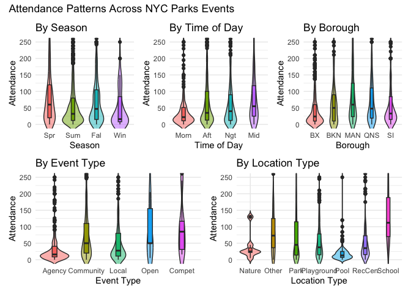
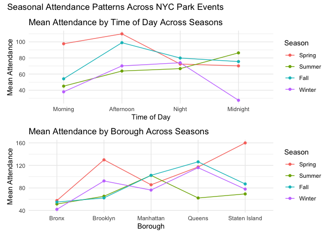
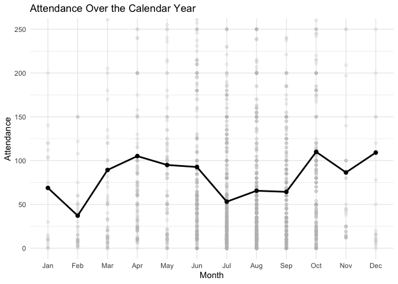

data clean
================
Huiyi Zhu
2025-12-04

## prepare

``` r
library(tidyverse)
```

    ## ── Attaching core tidyverse packages ──────────────────────── tidyverse 2.0.0 ──
    ## ✔ dplyr     1.1.4     ✔ readr     2.1.5
    ## ✔ forcats   1.0.1     ✔ stringr   1.5.2
    ## ✔ ggplot2   4.0.0     ✔ tibble    3.3.0
    ## ✔ lubridate 1.9.4     ✔ tidyr     1.3.1
    ## ✔ purrr     1.1.0     
    ## ── Conflicts ────────────────────────────────────────── tidyverse_conflicts() ──
    ## ✖ dplyr::filter() masks stats::filter()
    ## ✖ dplyr::lag()    masks stats::lag()
    ## ℹ Use the conflicted package (<http://conflicted.r-lib.org/>) to force all conflicts to become errors

``` r
library(janitor)
```

    ## 
    ## Attaching package: 'janitor'
    ## 
    ## The following objects are masked from 'package:stats':
    ## 
    ##     chisq.test, fisher.test

``` r
library(ggplot2)
library(patchwork)
```

outcome: attendance variables: season, event type, borough, location
type, time of date

Miranda Chen: model (before 11:59PM Friday) Huiyi Zhu: clean data
(date:2022.5-present, morning5-12 afternoon 12-6 night 6-1 midnight?) +
basic descriptive analysis Yiyang Jiao: report+video (9:00PM Sat)
Xiaoqian Lyu: report Yuyue Ma: web(sat)

## Data Cleaning

``` r
parkevent = read.csv("Parks_Special_Events_20251204.csv") |>
  janitor::clean_names() |>
  mutate(
    datetime = mdy_hms(date_and_time),
    date     = as_date(datetime), 
    year  = year(datetime),
    month = month(datetime, label = TRUE, abbr = TRUE),
    day = day(datetime),
    time = format(datetime, "%H:%M:%S"),
    season = case_when(
      month %in% c("Mar","Apr","May") ~ "Spring",
      month %in% c("Jun","Jul","Aug") ~ "Summer",
      month %in% c("Sep","Oct","Nov") ~ "Fall",
      month %in% c("Dec","Jan","Feb") ~ "Winter"), 
      season = factor(season,
        levels = c("Spring", "Summer", "Fall", "Winter")),
    hour = as.numeric(format(datetime, "%H")),
    time_period = case_when(
      hour < 5 ~ "Midnight",
      hour >= 5  & hour < 12 ~ "Morning",
      hour >= 12 & hour < 18 ~ "Afternoon",
      hour >= 18 & hour < 23 ~ "Night",
      hour >= 23   ~ "Midnight"),
   time_period = factor(time_period,
                     levels = c("Morning", "Afternoon", "Night", "Midnight")),
    attendance = as.numeric(attendance))|>  
  select(
    -datetime,
    -unit,
    -group_name_partner,
    -date_and_time,
    -classification,
    -source,
    -audience,
    -hour,
    -event_name,
    -location) |> 
  select(
    date, year, month, day, time, season,
    everything()) |> 
    filter(date >= as.Date("2021-06-01"),
           event_type != "",
           category != "",
           attendance != "")
```

    ## Warning: There was 1 warning in `mutate()`.
    ## ℹ In argument: `attendance = as.numeric(attendance)`.
    ## Caused by warning:
    ## ! NAs introduced by coercion

We cleaned the dataset to prepare it for analyzing attendance as the
primary outcome and key predictors including season, event_type,
borough, location_type, and time_period. Date-time information was
parsed into date, year, month, and day to support temporal analyses, and
time_period was created to evaluate differences across times of day. We
filtered observations to the NYC fully reopened period after COVID (date
\>= “2021-06-01”) to avoid pandemic-related disruptions. Columns not
relevant to the analysis were removed, and rows with empty event_type,
category and attendance values were dropped. After cleaning, we have
2447 observations and 12 variables. These steps produced a tidy dataset
aligned with our study.

## Descriptive Analysis

``` r
parkevent |>
  summarize(
    mean_attendance = mean(attendance),
    median_attendance = median(attendance),
    sd_attendance = sd(attendance),
    min_attendance = min(attendance),
    max_attendance = max(attendance)) |>
  knitr::kable(digits = 2)
```

| mean_attendance | median_attendance | sd_attendance | min_attendance | max_attendance |
|---:|---:|---:|---:|---:|
| 74.44 | 39 | 100.95 | 0 | 861 |

This table summarizes the distribution of attendance across all
post-COVID events, including the mean, median, variability, and range of
turnout. These descriptive statistics provide an essential baseline for
understanding overall engagement levels and for comparing attendance
across seasons, event types, boroughs, and time-of-day categories in
subsequent analyses.

``` r
plot_season =
  ggplot(parkevent, aes(x = season, y = attendance, fill=season)) +
  geom_violin(trim = FALSE, alpha = 0.5) +
  geom_boxplot(width=0.15) +
  coord_cartesian(ylim = c(0,250)) +
  scale_x_discrete(labels = c(
    "Spring" = "Spr",
    "Summer" = "Sum",
    "Fall"   = "Fal",
    "Winter" = "Win")) +
  labs(title = "By Season", x = "Season", y = "Attendance") +
  guides(fill = "none") +
  theme_minimal()

plot_time =
  ggplot(parkevent, aes(x = time_period, y = attendance, fill=time_period)) +
  geom_violin(trim = FALSE, alpha = 0.5) +
  geom_boxplot(width=0.15) +
  coord_cartesian(ylim = c(0,250)) +
  scale_x_discrete(labels = c(
    "Morning"   = "Morn",
    "Afternoon" = "Aft",
    "Night"     = "Ngt",
    "Midnight"  = "Mid")) +
  labs(title = "By Time of Day", x = "Time of Day", y = "Attendance") +
  guides(fill = "none") +
  theme_minimal()

plot_type =
  ggplot(parkevent, aes(x = event_type, y = attendance, fill = event_type)) +
  geom_violin(trim = FALSE, alpha = 0.5) +
  geom_boxplot(width = 0.15) +
  coord_cartesian(ylim = c(0,250)) +
  scale_x_discrete(labels = c(
    "Agency Produced Event" = "Agency",
    "Community Based Event" = "Community",
    "Local Event" = "Local",
    "Open House" = "Open",
    "Tournament/Competition" = "Compet")) +
   guides(fill = "none") +
  labs(
    title = "By Event Type",
    x = "Event Type",
    y = "Attendance") +
  theme_minimal()

plot_borough =
  ggplot(parkevent, aes(x = borough, y = attendance, fill=borough)) +
  geom_violin(trim = FALSE, alpha = 0.5) +
  geom_boxplot(width=0.15) +
  coord_cartesian(ylim = c(0,250)) +
  scale_x_discrete(labels = c(
    "Bronx"        = "BX",
    "Brooklyn"     = "BKN",
    "Manhattan"    = "MAN",
    "Queens"       = "QNS",
    "Staten Island"= "SI")) +
  labs(title = "By Borough", x = "Borough", y = "Attendance") +
  guides(fill = "none") +
  theme_minimal()

plot_location =
  ggplot(parkevent, aes(x = location_type, y = attendance, fill = location_type)) +
  geom_violin(trim = FALSE, alpha = 0.5) +
  geom_boxplot(width = 0.15) +
  coord_cartesian(ylim = c(0,250)) +
  scale_x_discrete(labels = c(
    "Nature Center" = "Nature",
    "Recreation Center" = "RecCen",
    "Playground" = "Playground",
    "Pool" = "Pool",
    "Park" = "Park",
    "Other" = "Other",
    "School" = "School")) +
  labs(
    title = "By Location Type",
    x = "Location Type",
    y = "Attendance") +
   guides(fill = "none") +
  theme_minimal()

patterns_plot =
  ((plot_season |plot_time| plot_borough) /
    (plot_type| plot_location))+
  plot_annotation(
    title = "Attendance Patterns Across NYC Parks Events",
    theme = theme())
patterns_plot
```

<!-- -->

``` r
plot_time_season =
  parkevent |>
  group_by(time_period, season) |>
  summarize(mean_attendance = mean(attendance)) |>
  ggplot(aes(x = time_period, 
             y = mean_attendance, 
             color = season, 
             group = season)) +
  geom_line() +
  geom_point() +
  labs(
    title = "Mean Attendance by Time of Day Across Seasons",
    x = "Time of Day",
    y = "Mean Attendance",
    color = "Season") +
  theme_minimal()
```

    ## `summarise()` has grouped output by 'time_period'. You can override using the
    ## `.groups` argument.

``` r
plot_borough_season =
  parkevent |>
  group_by(borough, season) |>
  summarize(mean_attendance = mean(attendance)) |>
  ggplot(aes(x = borough, 
             y = mean_attendance, 
             color = season, 
             group = season)) +
  geom_line() +
  geom_point() +
  labs(
    title = "Mean Attendance by Borough Across Seasons",
    x = "Borough",
    y = "Mean Attendance",
    color = "Season") +
  theme_minimal()
```

    ## `summarise()` has grouped output by 'borough'. You can override using the
    ## `.groups` argument.

``` r
Seasonal_plot =
  (plot_time_season / plot_borough_season) +
  plot_annotation(
    title = "Seasonal Attendance Patterns Across NYC Park Events")

Seasonal_plot
```

<!-- -->

``` r
plot_calendar =
  ggplot(parkevent, 
         aes(x = month(date, label = TRUE, abbr = TRUE), 
             y = attendance)) +
  geom_point(alpha = 0.2, color = "gray") +
  stat_summary(fun = mean, geom = "line", aes(group = 1),
               color = "black", size = 1) +
  stat_summary(fun = mean, geom = "point",
               color = "black", size = 2) +
  labs(
    title = "Attendance Over the Calendar Year",
    x = "Month",
    y = "Attendance") +
  coord_cartesian(ylim = c(0, 250)) + 
  theme_minimal()
```

    ## Warning: Using `size` aesthetic for lines was deprecated in ggplot2 3.4.0.
    ## ℹ Please use `linewidth` instead.
    ## This warning is displayed once every 8 hours.
    ## Call `lifecycle::last_lifecycle_warnings()` to see where this warning was
    ## generated.

``` r
plot_calendar
```

<!-- -->
