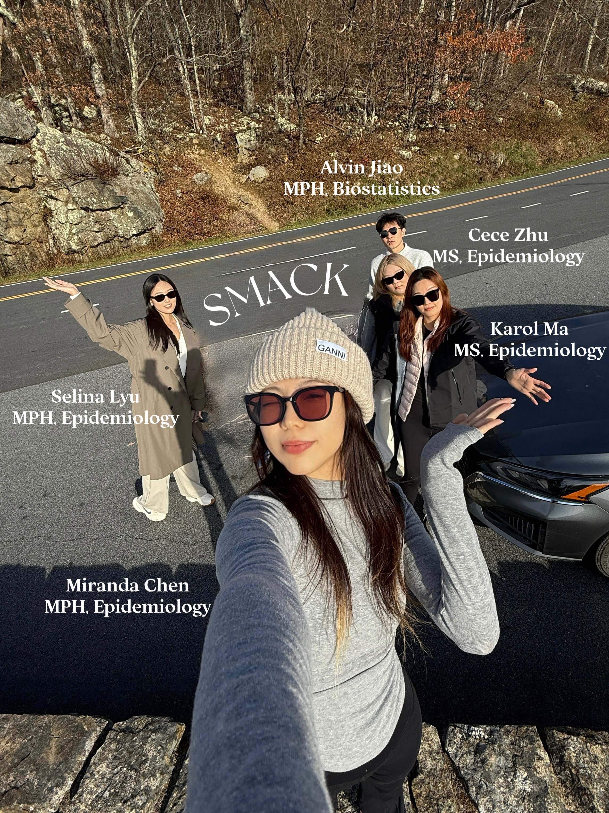

<h1 style="font-size: 48px; font-weight: 700; text-align: center;">
The Pulse of the Park  
</h1>      
        
            
<iframe width="800" height="450"
        src="https://www.youtube.com/embed/JDdLdAUY-vc&list=PLD14Rz0JtYhiUdqmjQN4totfX31Rz2RMq&index=2"
        allowfullscreen></iframe>

## Motivation

New York sells itself on vibrant public life—but a city’s real magnetism shows up in how well it shares its spaces and resources. Understanding what drives public participation in community events is essential for effective urban planning and equitable resource allocation. NYC Parks hosts thousands of special events each year, yet attendance varies widely across neighborhoods, seasons, and program types. These patterns matter because well-attended events strengthen community engagement, promote physical activity, and ensure that public resources are used efficiently. At the same time, imbalances in participation may reflect disparities in accessibility or programming that does not fully meet community needs. By identifying the conditions associated with higher participation, we aim to provide insights that can help guide more inclusive and effective public programming in New York City.  

## Overall Impact of the Project

This project provides the first systematic, data-driven exploration of attendance patterns across NYC Parks special events since the city’s full reopening in mid-2021. The findings demonstrate that outdoor public programming remains a highly utilized community resource and that attendance varies in predictable ways that city agencies can act upon.
These insights support evidence-based planning for park programming, staffing, resource allocation, and equity-focused outreach.

## Policy and Program Recommendations

**1. Increase Summer Programming Capacity**

Attendance is highest in Summer, especially at “Kids-friendly” and “General Public” events.
 
Recommendation:
NYC Parks should allocate more staff, security, and event funding during high-demand months (June–August), particularly in Manhattan and Queens where open-air programs attract large crowds.

**2. Target Off-Peak Months With Community-Focused Events**

Attendance in Winter and late Fall is comparatively low.

Recommendation:
Introduce smaller-scale indoor or hybrid activities in colder months, especially in boroughs with fewer community centers.
This can reduce seasonal access disparities and maintain steady community engagement year-round.

**3. Expand Morning and Afternoon Programming**

The analysis shows that Morning and Afternoon events consistently attract higher attendance than Night events.

Recommendation: Prioritize daytime events when scheduling family-oriented or senior-friendly activities, and pilot safer, better-lit evening events in neighborhoods with existing interest.

**4. Equity-Focused Resource Allocation by Borough**

Queens and Manhattan venues host the highest-attended events, while areas such as the Bronx underperform.

Recommendation: Use attendance data to redirect advertising, transportation support, and grants to under-attended boroughs to improve equitable access to cultural and recreational programming.

**5. Tailor Programs to Audience Types**

Kids-friendly events consistently outperform adults-only events in attendance.

Recommendation: Increase youth-oriented programming, integrate school partnerships, and expand family-friendly festivals—especially in parks located near residential areas and schools.

**6. Improve Data Collection for More Robust Future Planning**

Inconsistent audience labels, missing categories, and varying event classification limit analysis depth.

Recommendation: NYC Parks should standardize data entry for:

- Audience type

- Event category

- Exact venue type

- Precise attendance counting methodology

A cleaner dataset will directly improve forecasting accuracy.

## Team Member
- Xiaoqian(**S**elina) Lyu -- MPH EPIDEMIOLOGY
- **M**iranda Chen -- MPH EPIDEMIOLOGY
- Yiyang(**A**lvin) Jiao -- MPH BIOSTATS
- Huiyi(**C**ece) Zhu -- MS EPIDEMIOLOGY
- Yuyue(**K**arol) Ma -- MS EPIDEMIOLOGY

Here is a picture of our **SMACK** team event.

{width=60%}

